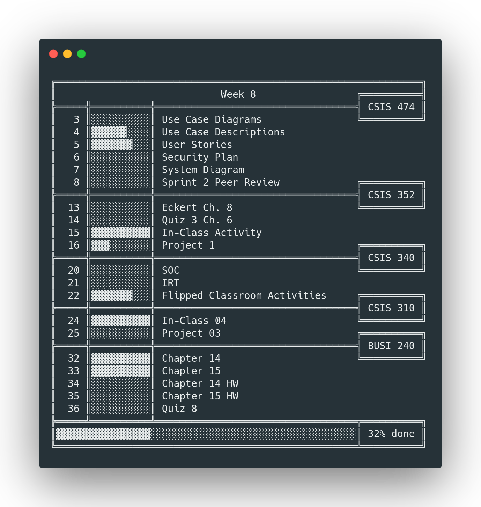

<h1 align="center">
  Tuesday
</h1>

<h3 align="center">An (improved rewrite) command-line task manager and course workload manager inspired by student woes, insufficient funds, hard limits on only 24 hour days, and monday.com</h3>



<p align="center">
  <a href="#key-features" style="color: red; padding-left: 10px; padding-right: 10px; padding-top: 5px; padding-bottom: 5px; border-radius: 3px; background-color: white; box-shadow: 0px 0px 5px 0px rgba(0,0,0,0.75);">Key Features</a> •
  <a href="#install">Install</a> •
  <a href="#develop">Develop</a> •
  <a href="#examples">Examples</a> •
  <a href="#contributing">Contributing</a> •
  <a href="#Todo">Todo</a> •
  <a href="#credits">Credits</a> •
  <a href="#license">License</a>
</p>


## Key Features
* **Manage grouped tasks in your work week**

* **Get Task and Week-Level Progress Indicators**
    * Way more realistic and and fun than just checking a box
* **Simple**
    * Data is store as `.csv` in your home director`
    * Zero configuration

## Requirements

_under construction_

## Install

_under construction_

## Develop

_under construction_


## Examples


**Get summary of week 3**
```
t 3
```

**Get summary of current week**
```
t
```

**Add a new task to a group**

Format: `group:week:task`

```
t a CSIS 430:8:Research Paper
```

*Output*
```
Task Added: [CSIS 430 8 Research Paper]
```

**Setting task progressing**

*Sets task id 21 to 50%*

```
t 21 50
```

## Data Storage

Data is stored in CSV format in a file located at `~/.tuesday/main.csv`

```
class,week,title,progress,type
BUSI 240,3,Reply 1,100,assign
BUSI 240,3,Reply 2,100,assign
BUSI 240,3,Chapter 5,100,study
BUSI 240,3,Chapter 5 HW,100,study
BUSI 240,3,Chapter 6,100,study
BUSI 240,3,Chapter 6 HW,100,study
BUSI 240,3,"Quiz 3 Chs. 5,6",100,assign
CSIS 310,3,Project 01,100,assign
CSIS 340,3,Read NIST Document,100,study
CSIS 340,3,Flipped Classroom Activities,100,assign
CSIS 352,3,Eckert Ch. 3,100,study
CSIS 352,3,Tomsho Ch. 2,100,study
CSIS 352,3,In-class Activity 1,100,study
CSIS 352,3,In-class Activity 2,100,study
```

## Rationale

I created this project for the following reasons:
* To manage my own coursework
* To learn Golang

## Disclaimer

The code and executables in this project are a **work in progress**. While they can be used an tools/toys and what have you, they are not production ready and **shouldn't be used on crital systems** without understanding these disclaimers. 


## Contributing

If you like this project, here are some ways you can contribute!

* Feature Requests
* Bug Reports
* Platform Testing

## Todo

* [] Use human readable data format
* [] Support multiple data files
* [] Write a network server for remote access and teams
* [] Implement golang version for higher performance and easy distribution


## Credits

This software uses the following open source and free tools:

- [Carbon](http://carbon.now.sh) (Code Screenshots)

## License

MIT


